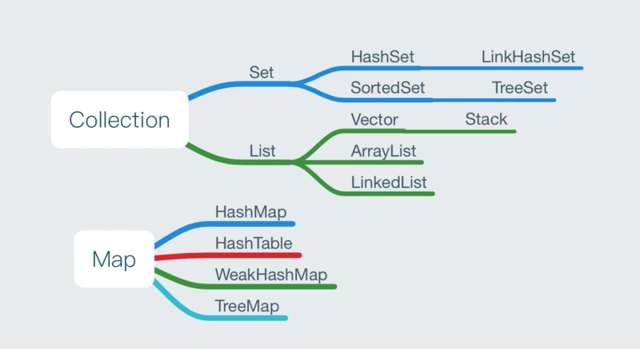

[TOC]


# **数据**
* [基本数据类型](#基本数据类型)

* [变量](#变量)

* [数组](#数组)

* [集合](#集合)

    * [集合框架：](#集合框架：)

    * [泛型](#泛型)

    * [Collection体系：](#Collection体系：)

    * [Map体系](#Map体系)
## 基本数据类型
内存管理系统根据变量的类型为变量分配存储空间，分配的空间只能用来储存该类型数据。Java语言提供了八种基本类型。六种数字类型（四个整数型，两个浮点型），一种字符类型，还有一种布尔型。


 | 数据类型 | 初始值 |
 | --- | ---|
 |  short 16位|0 |
 | int 32位 4字节|0
 | long 64位|0L
 | float 32位|0.0f
 | double 64位|0.0d
 | char 16位|'u0000'
 | byte 8位|0
 | boolean 1位|false

String不是Java的基本数据类型,初始值为'null'.

## 变量
在声明一个变量后,如果使用变量前需要变量初始化,否正Java编译器会报错</br>
`int firstnumber;`</br>
`firstnumber = 0;`
## 数组
概念: 
> 数组是一种数据结构,是用来储存同一类型值得集合.通过整形的数下标可以访问数组中的某一个值.在声明数组时,需要申明类型和变量名字.

定义:`int[] a;` or `int[] a = new int[100];`

For-Each 循环:</br>
该语句能在不使用下标的情况下遍历数组
> `for(int element: array)`</br>
&nbsp;&nbsp;&nbsp;&nbsp;`{
    System.out.println(element);
}`
## **集合**
### **集合框架：**
> Java中的集合框架大类可分为Collection和Map；</br>



两者的区别：
1. Collection是单列集合；Map是双列集合(键值对形式)
2. Collection中只有Set系列要求元素唯一；Map中键需要唯一，值可以重复
3. Collection的数据结构是针对元素的；Map的数据结构是针对键的。
### **泛型**

概念:

>泛型，即“类型的参数化”。在程序中我们将一个对象放入集合中，但是集合不会记住对象的类型，当我们在次使用对象的时候，对象变为Object类型，而程序中还是原来的类型，我们必须要自己转换其类型，为了解决这个问题，则提出泛型。举例:</br>

// 不加泛型</br>
 &nbsp;   ` List list = new ArrayList<>();`</br>
 // 加泛型(声明了集合的数据类型)</br>
 &nbsp;   `List<String> list = new ArrayList<String>();`</br>

### **Collection体系：**
Collection包括两大体系，List和Set

* List的特点：

> 集合的的最大目的就是为了存取；List集合的特点就是存取有序，可以存储重复的元素，可以用下标进行元素的操作

常用的有ArrayList，LinkedList，Vector

**ArrayList:** 底层是使用数组实现，所以查询速度快，增删速度慢

```
        List<String> list = new ArrayList<String>();
        list.add("接口1");
        // 第一种遍历方式,使用迭代器
        Iterator<String> it = list.iterator();
        while(it.hasNext()){
            String next = it.next();
            System.out.println(next);
        }
  
```
`Java8中使用Stream的filter对集合进行过滤,使用collect()将stream转化为一个集合。`
```
使用方法: 
List<String> result.stream()    // convert list to stream
    .filter(line -> !"ricky".equals(line))      // 返回为结果true的对象
    .collect(Collectors.toList());  		//转化为集合

在lambda 表达式中可以使用判断语句,返回结果为true的对象
```

**LinkedList:** 是基于链表结构实现的，所以查询速度慢，增删速度快，提供了特殊的方法，对头尾的元素操作（进行增删查）。使用LinkedList来实现栈和队列；栈是先进后出，而队列是先进先出

* Set的特点：

> Set集合的特点：元素不重复，存取无序，无下标 

Set集合下面有：HashSet，LinkedHashSet，TreeSet

**HashSet:**
```

        Set<String> set = new HashSet<String>();
        set.add("我的天");
        
        // 遍历 第一种方式 迭代器
        Iterator<String> it = set.iterator();
        while(it.hasNext()){
            String str = it.next();
            System.out.println(str);
        }
    }
    
```
**LinkedHashSet** 是基于链表和哈希表共同实现的，所以具有存取有序，元素唯一
```

        LinkedHashSet<Person> set = new LinkedHashSet<Person>();
        
        set.add(new Person("张三", 12));
        // 遍历
        for (Person p : set){
            System.out.println(p);
        }
        Person [name=张三, age=12]
    }
    
}
```
**TreeSet** :存取无序，元素唯一，可以进行排序（排序是在添加的时候进行排序）。

 **比较器总结：**
* **Collection体系总结：**

    >List  : "特点 :" 存取有序,元素有索引,元素可以重复.

    >ArrayList : 数组结构,查询快,增删慢,线程不安全,因此效率高.

    >Vector : 数组结构,查询快,增删慢,线程安全,因此效率低.

    >LinkedList : 链表结构,查询慢,增删快,线程不安全,因此效率高.

    >Set   :"特点 :" 存取无序,元素无索引,元素不可以重复.

    >HashSet : 存储无序,元素无索引,元素不可以重复.底层是哈希表.

### Map体系：

定义:
>Map是一个双列集合，其中保存的是键值对，键要求保持唯一性，值可以重复,存取无序.其中下面有HashMap，LinkedHashMap和TreeMap

**HashMap:** 是基于哈希表结构实现的，所以存储自定义对象作为键时，必须重写hasCode和equals方法。存取无序的
```
    HashMap<String,String> map = new HashMap<Person,String>();

    map.put("name", "jack");

```
**LinkedHashMap:**用法跟HashMap基本一致，它是基于链表和哈希表结构的所以具有存取有序，键不重复的特性

```
    LinkedHashMap<Person,String> map = new LinkedHashMap<Person,String>(); 

    map.put("name", "jack");
```
**TreeMap:**给TreeMap集合中保存自定义对象，自定义对象作为TreeMap集合的key值。


