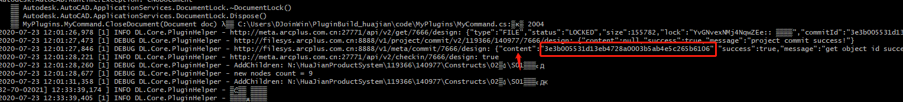
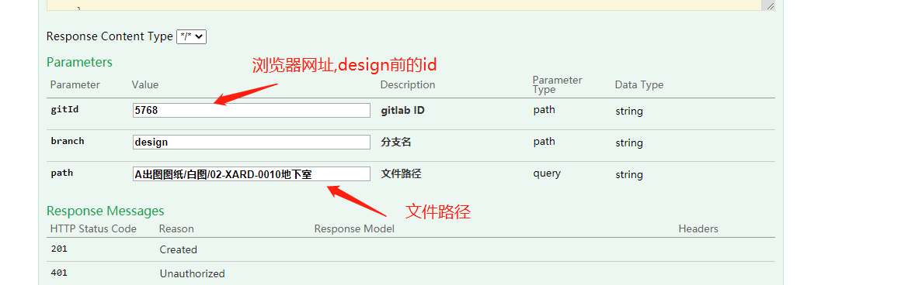
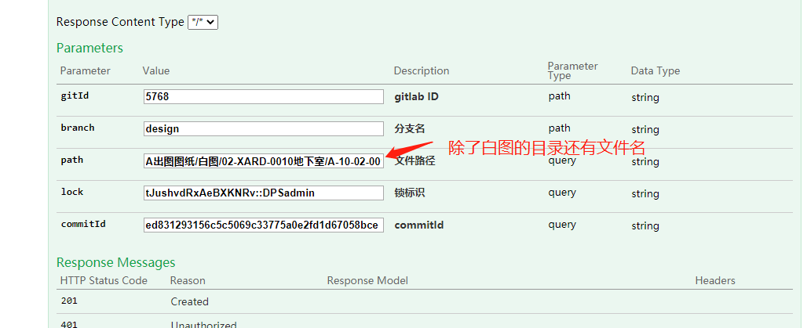

* ##  迁出异常:
    问题描述:插件上双击dwg提示:迁出异常,请稍后重试.导致无法正常迁出dwg. 
    解决方法:
    1. 找到cad日志目录->C:\Users\DELL\AppData\Roaming\HuaJianProductSystem\logs, 使用git 命令:tail -f cdccplugin.log(持续输出最后的命令),输出日志信息.在插件上双击无法迁出的文件,会输出文件的commitid,如下
    
    2. 访问[**RepoKeeper RESTful API** ](http://10.10.75.114:27771/swagger-ui.html#/RepoKeeper25805203162550921475)  
    第一步获取文件信息:调用POST /api/v2/tree/{gitId}/{branch} 接口获取文件信息.接口参数值为: gitId(专业id),branch('design'),path(文件所在目录). 
    
    第二步迁出:调用POST /api/v2/checkout/{gitId}/{branch}接口,该接口可以迁出文件,该接口的参数都可以从上一个接口返回的书记获取(lock:tJushvdRxAeBXKNRv::DPSadmin),刷新客户端,可以看到该文件已经被DPSadmin迁出. 
    第三步迁入:调用POST /api/v2/checkin/{gitId}/{branch}接口,迁入文件.这是要用到上面命令行输出的commitid作为该接口的commitId参数值,其他的参数参考第二步(迁出).

* ## pdf被锁住
    问题描述:pdf无法删除,原因是因为被锁住了.
    解决方法:
    1. 访问[**RepoKeeper RESTful API** ](http://10.10.75.114:27771/swagger-ui.html#/RepoKeeper25805203162550921475)  
        第一步获取文件信息:调用POST /api/v2/tree/{gitId}/{branch} 接口获取文件信息,可以看到文件的status:locked.接口参数值为: gitId(专业id),branch('design'),path(文件所在目录). 
        第二步恢复文件的状态（迁出）.调用/api/v2/checkout/{gitId}/{branch}
        

